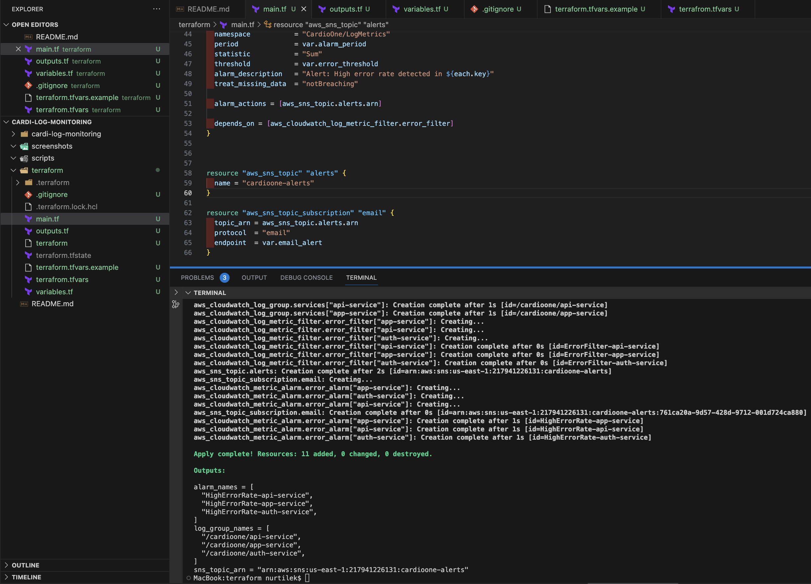
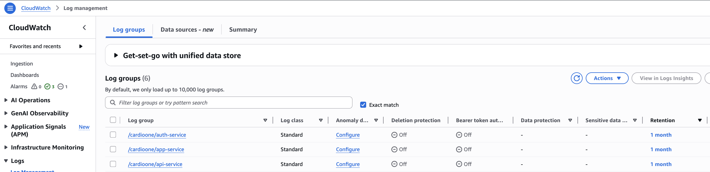
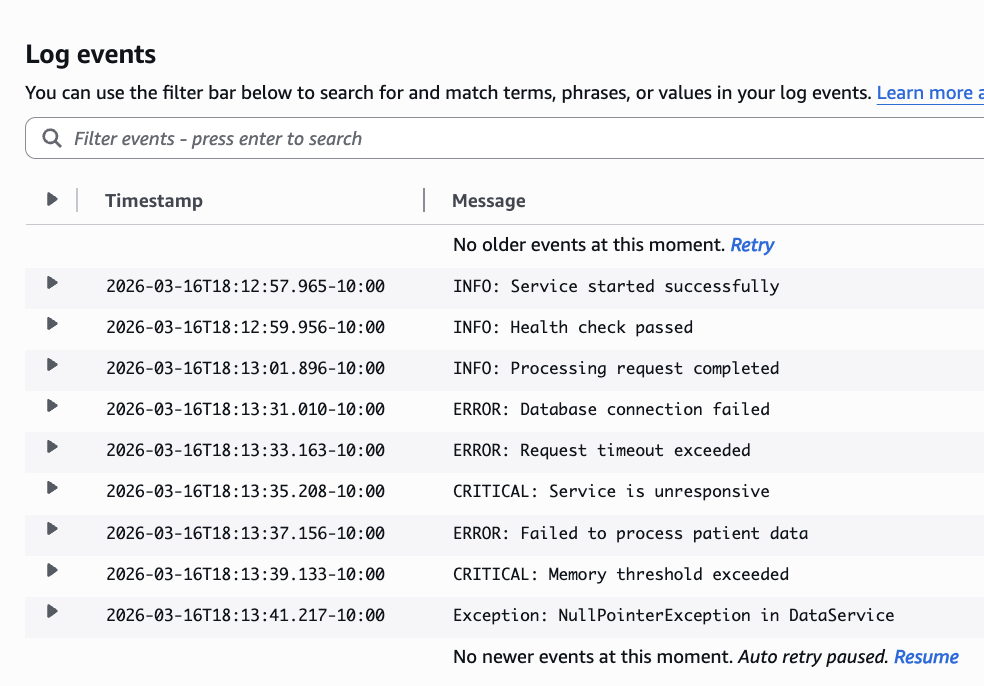
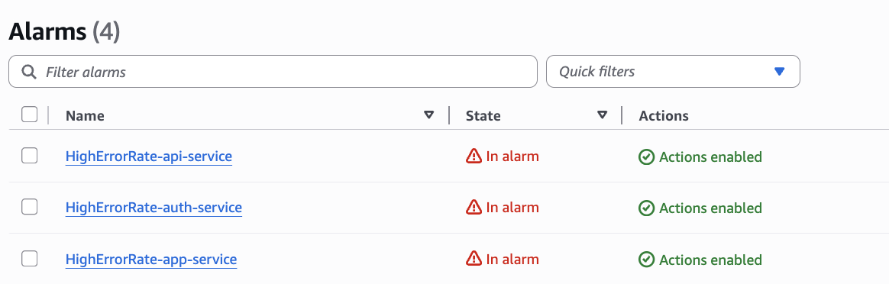
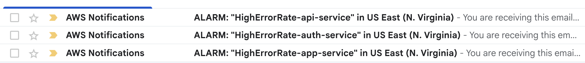
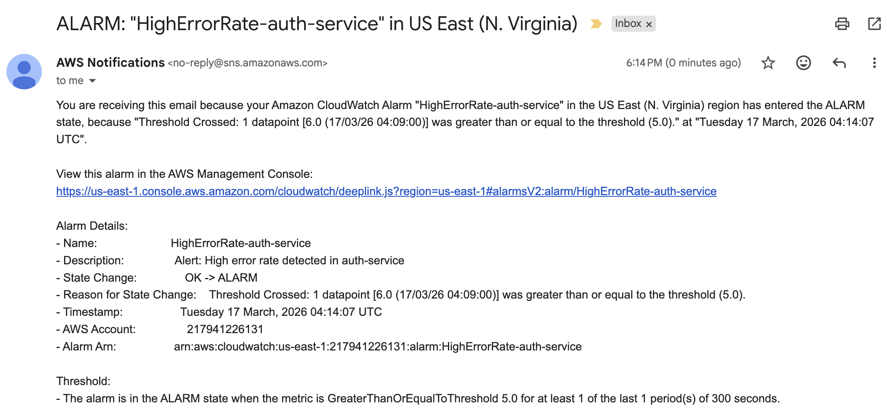
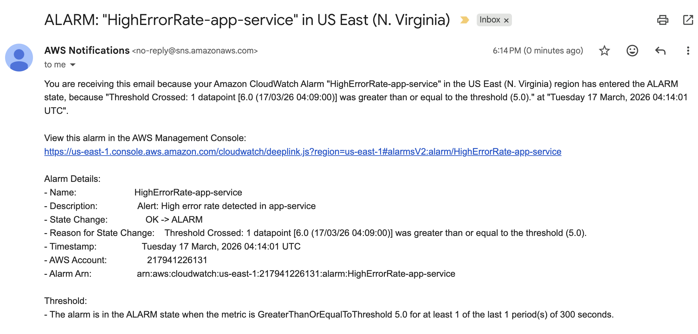
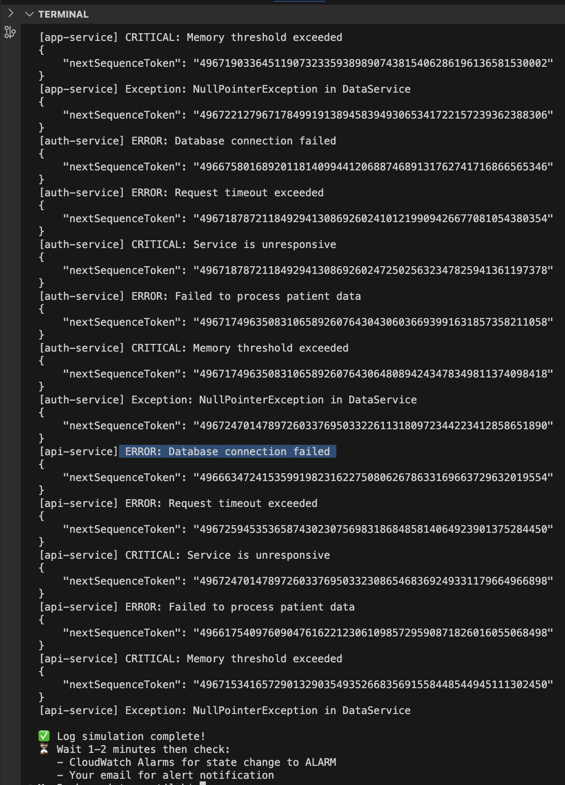

# Log Monitoring & Alerting System

## Overview
This is a log monitoring and alerting system for production environment. 
What it does:
- Continiously collects logs from multiple services
- Analyzes them in near realtime
- Alerts the operations team when critical issues are detected.

## Problem Statement
Production services generate logs locally on each server and are reviewed only after incidents occur. 
I am going to centralize logs, it detects errors automatically, and alerting the team before issues escalate.

I am responsible for improving the reliability of a production system that runs multiple services across several servers. 
Each service generates application and system logs that include informational messages, warnings, and error events. 
Currently, these logs are stored locally on each server and are reviewed only after incidents occur.

Design a log monitoring and alert system that continuously collects logs, analyzes them in near real-time, and alerts the operations team when critical issues are detected.

The system should be able to:
- Monitor log files from multiple services and servers
- Detect predefined error patterns (e.g., ERROR, CRITICAL, repeated exceptions)
- Trigger alerts when error rates exceed configurable thresholds
- Minimize false positives while ensuring timely alerts
- Anything else you can think of

---

## Solution Overview
This project implements a fully automated log monitoring and alerting system for CardioOne's production environment using AWS CloudWatch and Terraform as Infrastructure as Code.

The system:
- Continuously collects logs from multiple services
- Analyzes them in near real-time
- Alerts the operations team when critical issues are detected
- Visualizes service health on a real-time dashboard

---

## Architecture
Multiple Services → CloudWatch Log Groups → Metric Filters → CloudWatch Alarms → SNS → Email Alert


## Tech Stack
- **Terraform** — provisions all AWS resources with a single command
- **AWS CloudWatch Log Groups** — Centralized log collection from multiple services
- **AWS CloudWatch Metric Filters** — Detects ERROR, CRITICAL, Exception patterns in real-time
- **AWS CloudWatch Alarms** — Triggers when error rate exceeds configurable threshold
- **AWS CloudWatch Dashboard** — Visual real-time monitoring of all services
- **AWS SNS** — Delivers email alerts to the operations team
- **Bash** — Log simulator script to test and demonstrate the system

## Repository Structure
```
cardioone-log-monitoring/
├── terraform/                    # All infrastructure as code
│   ├── main.tf                   # Main infrastructure resources
│   ├── variables.tf              # Configurable variables
│   ├── outputs.tf                # Output values after deployment
│   ├── terraform.tfvars.example  # Example variables template
│   └── .gitignore                # Excludes sensitive files
├── scripts/
│   └── simulate_logs.sh          # Log simulator for testing
├── screenshots/                  # Project screenshots
└── README.md                     # Project documentation
```

---

## How It Works — Step by Step

### Step 1 — Infrastructure Provisioned with Terraform
All AWS resources are created with a single command using Terraform.
No manual clicking in AWS console — everything is reproducible and version controlled.
**Result:** 11 AWS resources created in under 30 seconds.



---

### Step 2 — CloudWatch Log Groups Created
Three log groups created — one per service — to collect and centralize logs from multiple services and servers.
- `/cardioone/app-service`
- `/cardioone/auth-service`
- `/cardioone/api-service`

**Result:** Logs from all services are now centralized in AWS CloudWatch instead of sitting locally on each server.



---

### Step 3 — Error Pattern Detection
CloudWatch Metric Filters watch every log line in real-time and count occurrences of:
- `ERROR` — application errors
- `CRITICAL` — critical failures  
- `Exception` — code exceptions

**Result:** Every error event is automatically detected and counted — no manual log review needed.



---

### Step 4 — Threshold-Based Alerting
CloudWatch Alarms fire when error count exceeds **5 errors in 5 minutes** — a configurable threshold.
All 3 services are monitored independently with their own alarms.

**Result:** All 3 alarms triggered simultaneously when errors were detected — shown as "In alarm" state.



---

### Step 5 — Email Alerts Delivered
When alarms fire, SNS immediately delivers email notifications to the operations team with full alarm details including:
- Which service triggered the alarm
- Exact threshold that was crossed
- Timestamp of the event
- Direct link to AWS console

**Result:** Operations team received 3 email alerts within 2 minutes of errors occurring.








---

### Step 6 — Minimizing False Positives
Three mechanisms prevent unnecessary alerts:
1. **Threshold of 5 errors** — single errors don't trigger alarms, only sustained error rates do
2. **`treat_missing_data = notBreaching`** — if a service goes quiet or restarts, no false alarm fires
3. **Specific keyword patterns** — only ERROR, CRITICAL, Exception trigger counting. INFO and WARNING logs are completely ignored

**Result:** System is sensitive enough to catch real issues but smart enough to ignore noise.

---

### Step 7 — Real-Time Dashboard (Anything else we can think of)
A CloudWatch Dashboard was built to give the operations team a single-pane-of-glass view of all services.

The dashboard shows:
- **Alarm status** for all 3 services at a glance — green OK or red ALARM
- **Error count graphs** for each service with red threshold line at 5
- **Time range controls** — view last 1h, 3h, 12h, 1d, 1w

**Result:** Operations team can monitor all services in real-time from a single URL without switching between screens.


---


## Live Demo — How to Trigger Alerts

### Step 1 — Run the log simulator:
```bash
cd scripts
./simulate_logs.sh
```

### Step 2 — Watch the simulator output:
```
📝 Sending normal logs...
[app-service] INFO: Service started successfully
[app-service] INFO: Health check passed
⚠️  Sending ERROR logs to trigger alarms...
[app-service] ERROR: Database connection failed
[app-service] CRITICAL: Service is unresponsive
```



### Step 3 — Wait 2 minutes then check:
- CloudWatch Dashboard → alarms turn red
- Email inbox → 3 alert emails arrive

---

## How to Deploy

### Prerequisites
- AWS account with credentials configured (`aws configure`)
- Terraform installed

### Deploy
```bash
cd terraform
cp terraform.tfvars.example terraform.tfvars
# Edit terraform.tfvars with your email
terraform init
terraform validate
terraform plan
terraform apply
```

### Destroy
```bash
terraform destroy
```
> One command tears down all 11 resources cleanly — no orphaned infrastructure left behind.

---

## In Production
In a real production environment, this system would be extended with:
- **CloudWatch Agent** installed on each ECS task/server to automatically ship real application logs
- **Slack notifications** via SNS → Lambda → Slack webhook
- **PagerDuty integration** for on-call escalation
- **Log Insights queries** for deeper log analysis

---

## Author
Nurtilek — Site Reliability Engineer